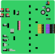

{ width="300" }

## Introduction

We have designed a PCB to emulate an EEG headset by demultiplexing the
signals from a multiplexed EEG signal provided by a Data Acquisition (DAQ) device,
a [National Instruments USB-6212](datasheets/usb-621x-manual.pdf).

## Description of the PCB

The design files and schematics of the PCB are available in the `eeg_demultiplexer/design_files`
directory.

### Analog part

The PCB is designed to demultiplex the 8 channels of the EEG signal from the DAQ
device, thus it has an analog input `EEG` and 8 main outputs `AOUT0` to `AOUT7`.

The analog input `EEG` must be in the range of 0-5V, since it is demultiplexed
with a [74HC4051](datasheets/74HC_HCT4051.pdf) analog demultiplexer. The outputs
of the demultiplexer are connected to the connections `A0` to `A7`,
which can be useful for debugging purposes.

Then, the signal is passed through the following sample-and-hold circuit, which is
followed by a voltage divider.

{ width="500" }

The sample-and-hold circuit is built with diode, a 1nF capacitor and a
[TL082](datasheets/tl082.pdf) operational amplifier. The diode and the capacitor
are used to sample the signal coming from the demultiplexer. A switch is used to
to short the capacitor to ground to discharge it before sampling the next
signal. The switch is controlled by the `DCHG` signal.

The operational amplifier is configured with a non-inverting gain of 2 by using
resistors with the same value of 2.1kΩ. Additionally, setting the
reference of the feedback at +5V allows to offset the output voltage by -5V.

The output of the operational amplifier is externalized to the `AAMP0` to `AAMP7`
connections, which can be useful for debugging purposes.

Finally, the output of the operational amplifier is passed through a voltage divider
to reduce the voltage in a factor of 5000, using a resistors of 2MΩ and 400Ω.

### Digital part

To control the selected channel of the demultiplexer, the PCB has a [74HC191](datasheets/74HC191.pdf)
counter. The counter is configured to count up. It has 4 parallel inputs which are loaded
when the `CP` signal is low. The default value to be loaded in the counter is 7.
This counter is clocked with the `CLK` signal. The three least significant
outputs of the counter are used as the channel selection signals, they are connected
to the demultiplexer channel selection, and can be consulted at the `CHAN0` to `CHAN2`
connections.

Two 2-input AND gates are used to know when the counter has reached the value 7. This
gates are available in the [74HC08D](datasheets/74HC_HCT08.pdf) package.
The output of the AND gates is connected to one of the pins of jumper `J13`. Other
pin of the jumper `J13` is connected to the total count signal of the counter, which
is 1 when the counter has reached the value 15. The default position of the jumper
`J13` is to connect its central pin to the output of the AND gates, which identifies when the
counter has reached the value 7.

The central pin of the jumper `J13` is connected to the control of two switches [ADG719](datasheets/ADG719.pdf).
The input of the first switch is connected to the `CLK` signal, and the output
is connected to the `START` signal, which can be used to trigger the conversion
of an ADC sampling the demultiplexed signals. The input of the second switch is
connected to the negated `CLK` signal, which is generated with an inverter [74HC04](datasheets/74HC_HCT1G04.pdf).
The output of this second switch is connected to the `DISCHARGE` signal, which
is used to discharge the capacitor of the sample-and-hold circuit.

Therefore, the following diagram shows the behavior of the digital part of the PCB:

```kroki-wavedrom
{ signal:
    [
      { name: 'CLK',      wave: 'P........', period: 2},
      { name: 'CHAN',     wave: '=========', data: ['0', '1', '2', '3', '4', '5', '6', '7', '0'], period: 2},
      { name: 'J16',      wave: '0......10', period: 2},
      { name: 'START',    wave: '0.............10..'},
      { name: '~CLK',     wave: 'N........', period: 2},
      { name: 'DISCARGE', wave: '0..............10.'},
    ]
}
```

## PCB characterization

To ensure the PCB is working properly, we have coded a simple test program,
`eeg_emulation/daq.py`, that uses the [nidaqmx](https://pypi.org/project/nidaqmx/)
library to control a National Instruments USB-6212 DAQ device. This program configures
the DAQ to:

- Ensure the channel in the counter of the PCB is set to 7.
- Create a clock signal `CTR0`, whose output is at `PFI12` pin of the DAQ.
- Create an analog output signal with the multiplexed EEG signal at pin `AO0`
  using the signal at `PFI0` as clock signal.
- Set 8 analog input pins to read the demultiplexed signals before the voltage
  divider. The pins of the PCB are `AAMP0` to `AAMP7`, and the pins of the DAQ
  are `AI0` to `AI7`. This conversion is triggered by the `START` signal, which
  is connected to the  `PFI2` pin of the DAQ device.